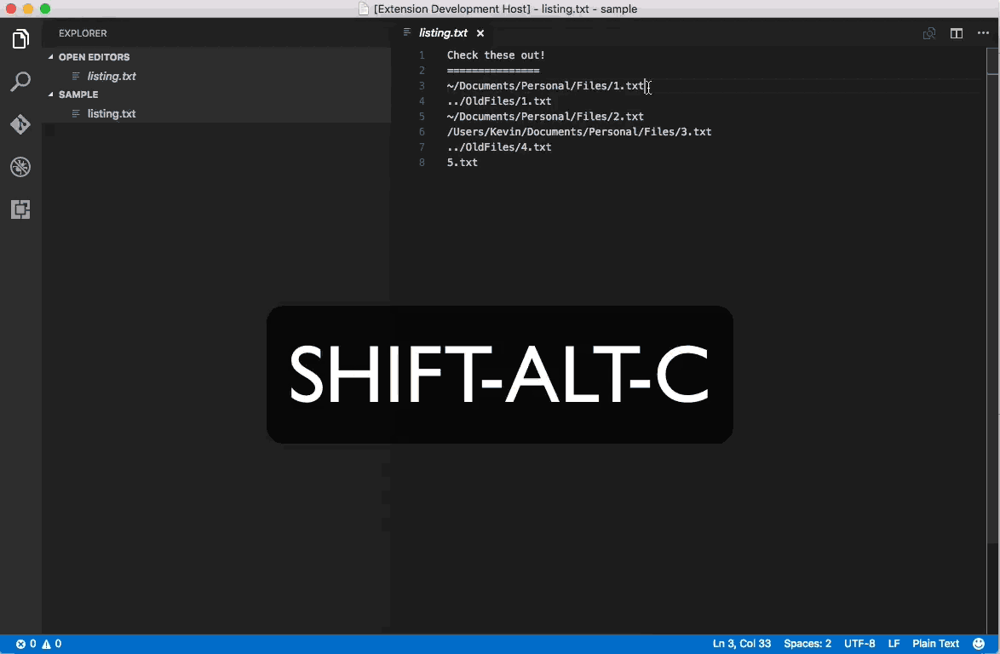
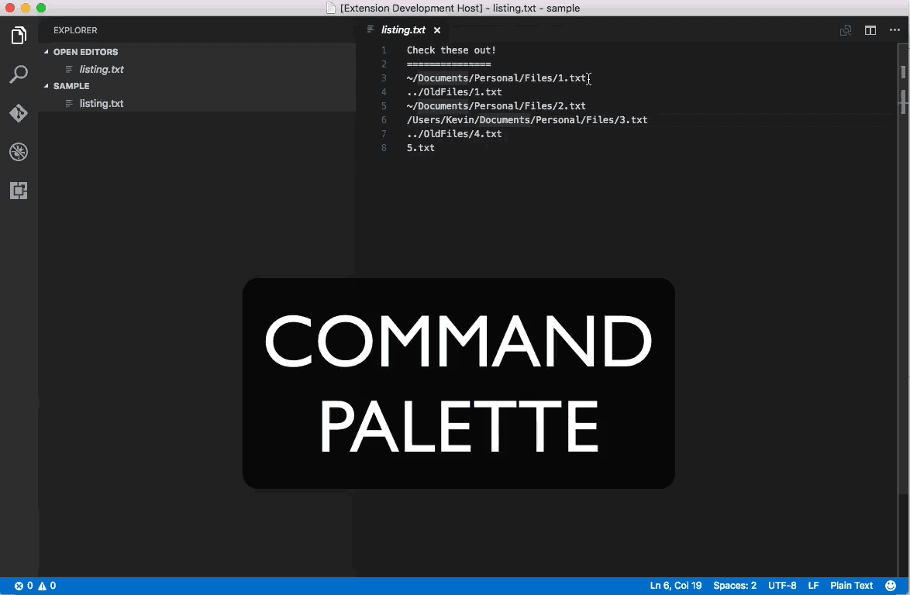
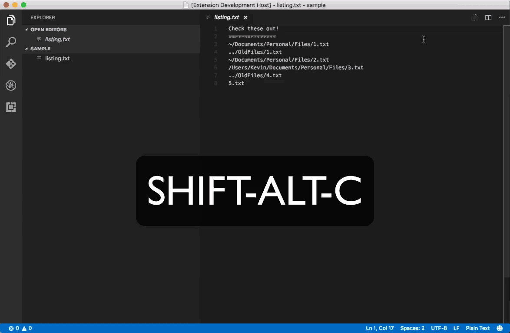

# copy-under

*copy-under* will allow you to take any selected text in one editor window and create a new file of the same type with only the selected lines.  It is very useful when combined with regular expression searches.

####Copy a single line w/ Shift-Alt-C keystroke  

####Copy a single line w/ Command Palette  

####Copy multiple lines via search w/ Shift-Alt-C keystroke

Use at your own risk.  Feel free to modify as you wish.

**Enjoy!**
